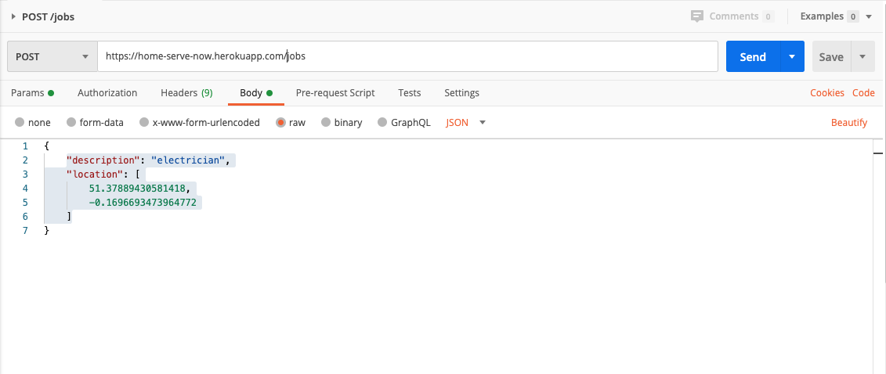
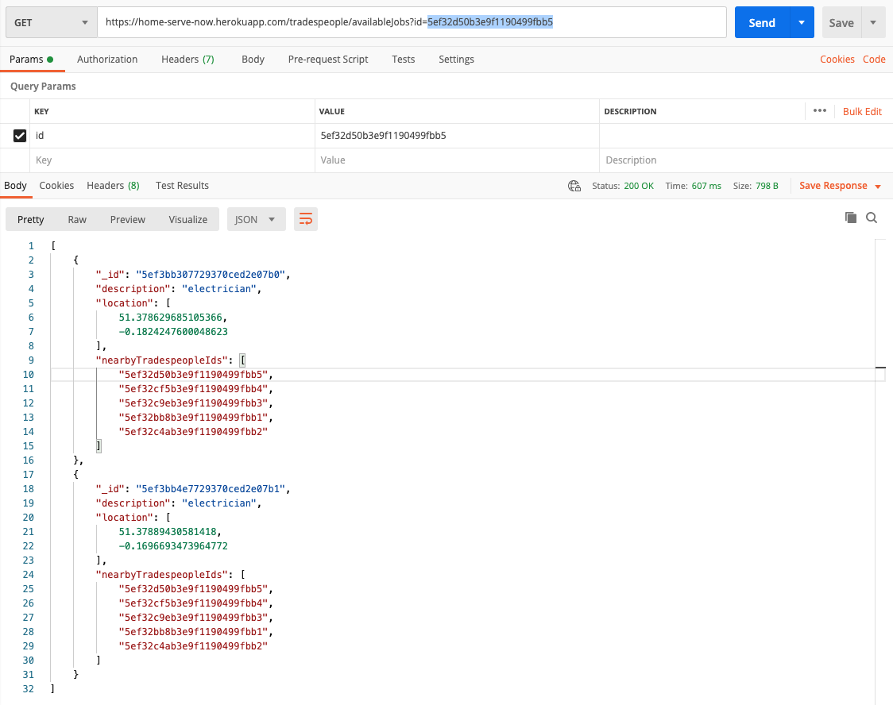
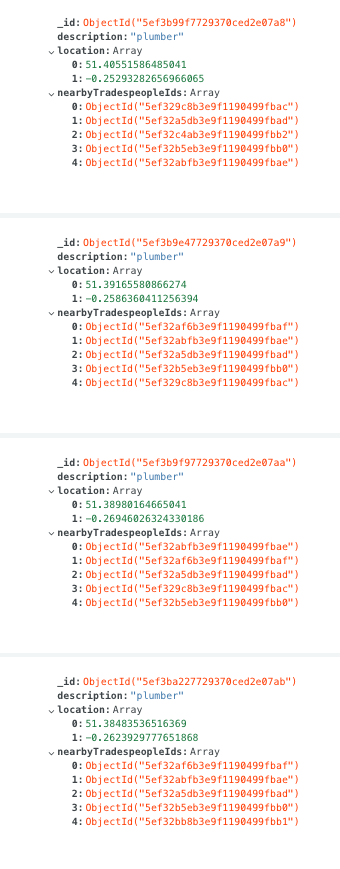
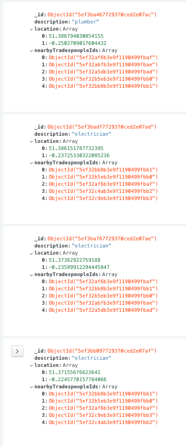
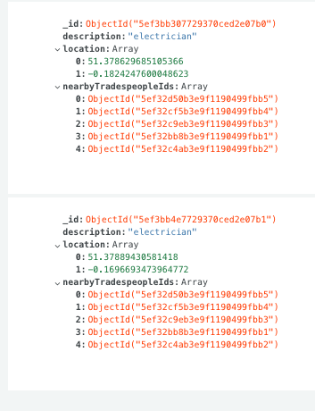
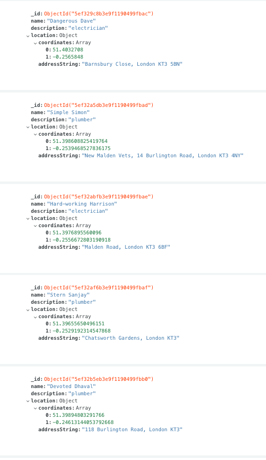
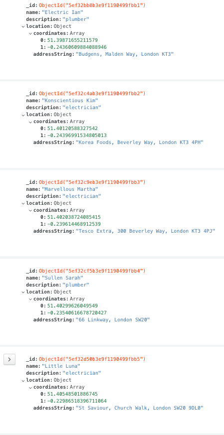

# HomeServeNow Tech Test - Back End
Techs used: node.js, express, mongoDB
This API is deployed at `https://home-serve-now.herokuapp.com/`, and has two routes exposed.

## POST `/jobs`
To create a job, hit the URL `https://home-serve-now.herokuapp.com/jobs` as a POST request, with the following JSON request body:
```
{
    "description": "electrician",
    "location": [
        51.37889430581418,
        -0.1696693473964772
    ]
}
```
Here is an example screenshot from Postman:


## GET `/tradespeople/availableJobs?id=<id>`
To see available jobs for a tradesperson, using the tradesperson's Id hit the URL `https://home-serve-now.herokuapp.com/jobs` with a GET request, using the Id as a Query Parameter e.g.:


## Test Data
To create the test data, I used the following website to generate coordinates from a sample of local addresses, using this website: https://www.gps-coordinates.net/. 
The test mentioned that jobs have description fields, and I wanted to take advantage of this detail in my code. I thought descriptions could be used to match tradespeople to jobs relevant to their trade, and consequently used them as such.

Below is all the test data I created for this test.

### MongoDB Job Data




### MongoDB Tradesperson Data

